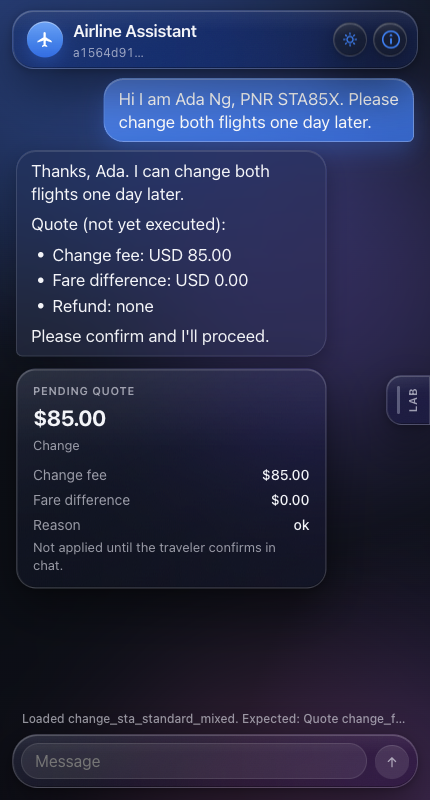
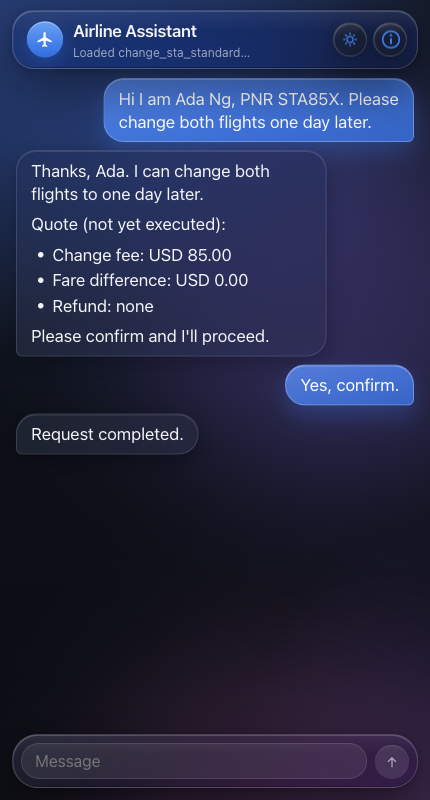
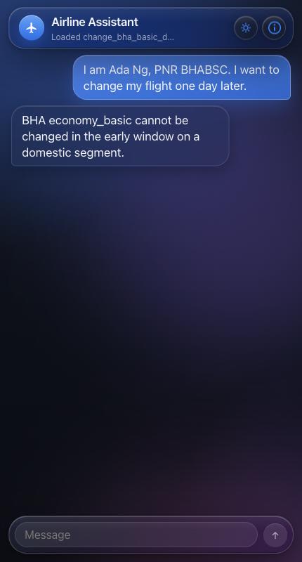
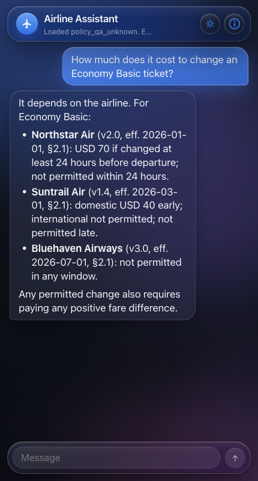

# 航司客服助手 / Airline Service Assistant

面向三家虚构航司（Suntrail Air、Northstar Air、Bluehaven Airways）的对话助手。同一进程提供两套 HTTP 接口：

Conversational assistant for three fictional airlines (Suntrail Air, Northstar Air, Bluehaven Airways). One process, two HTTP surfaces:

- `/api/assistant/*` -- 旅客助手 / customer assistant（OpenAI-compatible chat API + LangGraph + FAISS）
- `/api/mock/*` -- 订座试验台 / mock booking bench，用来灌入和查看测试数据 / used to seed and inspect test data

Python 依赖**只通过 [uv](https://docs.astral.sh/uv/) 管理**，不要用 `pip install`。

Python dependencies are managed **only with [uv](https://docs.astral.sh/uv/)**. Do not use `pip install`.

---

## 聊天 API 密钥 / Chat API key

本项目通过 **OpenAI 兼容的 Chat Completions** 调用聊天模型（OpenAI、DeepSeek、Moonshot/Kimi 等均可）。换服务商时必须同时改 `API_KEY`、`BASE_URL`、`MODEL`。**仓库里不含密钥。**

This project talks to an **OpenAI-compatible Chat Completions** API (OpenAI, DeepSeek, Moonshot/Kimi, and similar). Change `API_KEY`, `BASE_URL`, and `MODEL` together when you switch providers. **The git repository does not contain an API key.**

1. 把 `.env.example` 复制为 `.env`。 / Copy `.env.example` to `.env`.
2. 在 `.env` 里填入与服务商匹配的三项： / Put values that match your provider in `.env`:

```
API_KEY=your_key_here
BASE_URL=https://api.deepseek.com
MODEL=deepseek-chat
```

`BASE_URL` **不要**自带 `/v1`（客户端会追加）。示例 / Do **not** include `/v1` on `BASE_URL`; the client appends it. Examples:

- OpenAI: `BASE_URL=https://api.openai.com` `MODEL=gpt-4o-mini`
- Moonshot/Kimi: `BASE_URL=https://api.moonshot.cn` `MODEL=moonshot-v1-32k`

`.env` 已被 gitignore。检索用的向量由本地开源模型 `sentence-transformers/all-MiniLM-L6-v2` 生成（`uv run python -m backend.rag.ingest`）；运行时检索不会用聊天 API 做 embedding。

`.env` is gitignored. Embeddings / FAISS indexes are built locally with `sentence-transformers/all-MiniLM-L6-v2`. Runtime retrieval does not call the chat API for embeddings.

---

## 运行 / Run

```bash
uv sync --group dev
uv run python -m backend.rag.ingest
uv run uvicorn backend.app:app --host 0.0.0.0 --port 8080
```

前端可选热更新 / Frontend (optional hot reload):

```bash
cd frontend && npm install && npm run dev
```

Vite 会把 `/api` 代理到 8080。单进程演示时先构建 UI，再由 FastAPI 托管 `frontend/dist`：

Vite proxies `/api` to port 8080. For the single-process demo, build the UI and let FastAPI serve `frontend/dist`:

```bash
cd frontend && npm install && npm run build
uv run uvicorn backend.app:app --port 8080
```

打开 / Open http://127.0.0.1:8080

---

## 测试 / Tests

分层门禁，按这个顺序跑。默认套件**不必**标 `eval` -- 助手测试断言报价 / reason code，只有润色回复时才调用聊天模型。

Layered gates; run them in this order. Default suite does **not** need to be marked `eval` -- assistant tests assert quotes/reason codes and use the chat model only when composing prose.

```bash
uv run pytest tests/policy tests/mock tests/agent tests/rag   # policy/mock/rag 不需要聊天模型 / no chat model required
uv run pytest                                                # 全量，含 assistant API / full suite including assistant API
```

---

## 界面怎么点 / What to click in the UI

打开 http://127.0.0.1:8080。主界面是聊天。用聊天顶栏标题为 **Mock lab** 的按钮（info 图标）或右侧 **Lab** 把手打开 Mock Lab。预设来自 `GET /api/mock/presets`（id 与 [eval/cases.md](eval/cases.md) 和 `tests/` 相同）。在 Lab 里点一条用例：聊天草稿会填入该条的 `starterMessage`。从聊天发送；需要看订座行时再打开 Lab。聊天输入在 Lab 打开时不可用，发消息前请先关掉 Lab。

Open http://127.0.0.1:8080. The main view is the chat. Open **Mock Lab** with the header button titled **Mock lab** (info icon) or the right-edge **Lab** handle. Presets come from `GET /api/mock/presets` (same ids as [eval/cases.md](eval/cases.md) and `tests/`). Click a case in Lab: the chat draft prefills that case's `starterMessage`. Send from chat; reopen Lab to watch booking rows. The composer is inert while Lab is open -- close Lab before sending.

推荐路径（Lab 里显示的用例 **title**）/ Recommended path (case **title** as shown in Lab):

1. 在 **Change** 下点 **STA Standard mixed-route change = USD 85**（`change_sta_standard_mixed`）。
   发送预填：`Hi I am Ada Ng, PNR STA85X. Please change both flights one day later.`
   期望聊天 / 报价卡出现 **USD 85**。Lab 订座仍为 `scheduled`。
   输入 `Yes, confirm.` 再发送。Lab 状态变为 `changed`，航段日期 +1 天。
   Under **Change**, click **STA Standard mixed-route change = USD 85**. Send the prefilled message. Expect a quote of **USD 85**; Lab booking stays `scheduled`. Type `Yes, confirm.` Lab status becomes `changed`; segment dates move +1 day.
2. 在 **Change** 下点 **BHA Basic cannot change**（`change_bha_basic_denied`）。
   发送预填的 Ada Ng / `BHABSC` 消息。
   期望改签被拒（`not_permitted`），Lab 行程仍为 `scheduled`。
   Under **Change**, click **BHA Basic cannot change**. Expect the change to be refused (`not_permitted`). Lab itinerary stays `scheduled`.
3. 在 **Policy Q&A** 下点 **Unknown airline must not merge rules**（`policy_qa_unknown`）。
   发送：`How much does it cost to change an Economy Basic ticket?`
   期望**按航司分别**作答（STA / NSA / BHA 不同），而不是一个虚假的全球统一费用。
   Under **Policy Q&A**, click **Unknown airline must not merge rules**. Expect a **per-airline** answer, not one fake global fee.
4. 在 **Lookup** 下点 **PNR + surname is not enough**（`lookup_surname_only`）。
   发送：`Look up STA85X, last name Ng.`
   期望身份不足（`identity_insufficient`）；需要名字。
   Under **Lookup**, click **PNR + surname is not enough**. Expect identity rejection (`identity_insufficient`); first name is required.
5. 在 **Handoff** 下点 **Partly flown refund -> desk**（`handoff_partial`）。
   发送预填的 PARTLY 退款消息。
   期望转人工；不要套用整张未使用客票的退款表。
   Under **Handoff**, click **Partly flown refund -> desk**. Expect a desk handoff; do not apply the wholly-unused refund table.
6. **Custom / blank** -- 在 Lab 底部粘贴自己的 seed JSON 做调试。 / paste your own seed JSON at the bottom of Lab to debug.

真实对话截图（430 x 800 手机聊天框；关 Lab 后才能输入）/ Screenshots from a real run, framed at 430 x 800 (phone chat; Lab closed so the composer is usable):









两条路径的文字 trace / Written traces for two of these paths: [改签后确认 / change then confirm](eval/trace-one-conversation.md)，[未知航司政策问答 / unknown-airline policy QA](eval/trace-policy-qa-unknown.md)。

---

## API 速览 / API sketch

Mock：`POST /api/mock/sessions/{id}/load`、`load-preset`、`lookup`、`quote-change`、`quote-cancel`、`confirm`、clock、bookings。

Assistant：`GET /api/assistant/health`、`POST /api/assistant/sessions`、`POST /api/assistant/chat`（`Accept: application/json` 则返回 JSON，否则 SSE）、`GET .../trace`。会话是 LangGraph thread（`thread_id` = `session_id`），默认 checkpoint 到 sqlite（`data/checkpoints.sqlite`；测试用内存）。

Sessions are LangGraph threads (`thread_id` = `session_id`) checkpointed to sqlite (`data/checkpoints.sqlite` by default; tests use in-memory).
